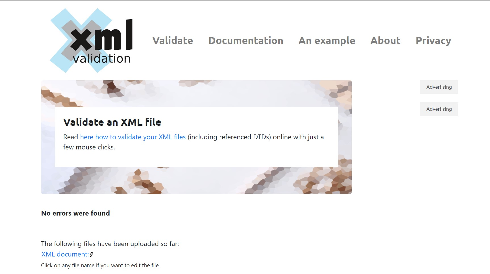

```{r}
# Load the package required to read XML files.
library("XML")

# Also load the other required package.
library("methods")


fp <- "hw8.xml"

xmlObj <- xmlParse(fp)
xmlObjTree <- xmlTreeParse(fp)

##find number of visit for page 200.
xpathEx <- "count(//log/Visit[@PageREF='200'])"
Num_visit <- xpathSApply(xmlObj, xpathEx, xmlValue)

print(paste("number of visit for page 200:", Num_visit[1]))


```

